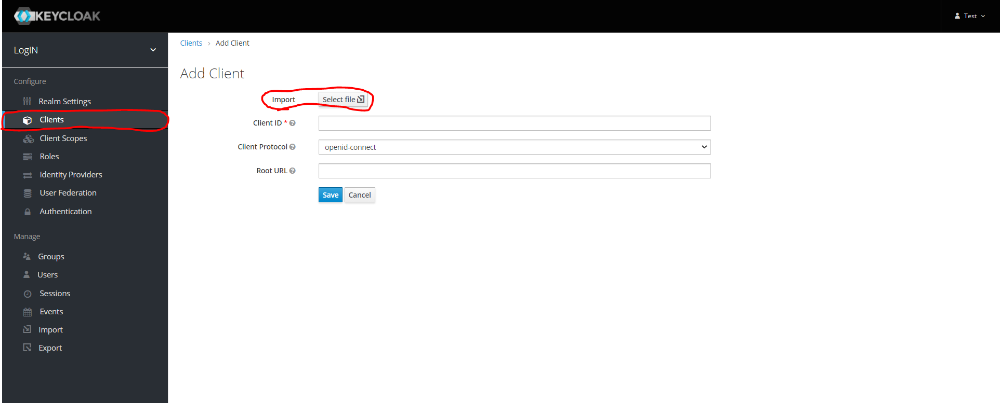

## Vorabinfo

Unser erstelltes Theme kann im Ordner custom angesehen und kopiert werden.
Die exportieren Client Dateien sind im Ordner Clients-Export
Die exportierte Realm Datei ist im Ordner Realm-Export

Um zu importieren siehe den Text unter der Überschrift Importieren.

## Keycloak Installation und Konfiguration


Für die Installation bzw. Konfiguration habe ich die Dokumentation von Keycloak verwendet: [Installation](https://www.keycloak.org/docs/latest/server_installation/) & [Konfiguration](https://www.keycloak.org/docs/latest/server_admin/#server-initialization)

Um Keycloak zu installieren muss die Umgebung mindestens Java 8 JDK haben.
Zuerst muss man sich Keycloak herunterladen [link](https://www.keycloak.org/downloads)
Nachdem denn man Keycloak herutnergeladen und entpackt hat muss man in den Ordner bin gehen und zuerst einen Admin User erstellen. (Hat man Zugriff über localhost so muss diese nicht gemacht werden, sondern kann über die Seite gemacht werden)

````bash
./add-user-keycloak.sh -r master -u <username> -p <password>
````

Danach kann man eine Keycloak Instanz  starten, dafür im selben Ordner den folgenden Command ausführen:

````bash
./standalone.sh -b <Ip-Adresse>
````

Der Parameter `-b` kann weggelassen werden, wenn man nur möchte dass Keycloak über localhost zugegriffen werden kann.

Damit hätte man Keycloak gestartet und kann jetzt über `http://localhost:8080/auth` aufgerufen werden (ist Zugriff von localhost nicht möglich, dann muss man beim starten des Server den Parameter -b benutzten und die Seite über `http://<IP-Adresse>:8080/auth` aufrufen). Auf dieser Seite kommt man zur Admin Konsole und kann Keycloak konfigurieren. (Da wir nicht über localhost zugreifen, bekommen wir die Meldung dass der initiale Admin User nur über localhost bzw. über das Script add-user erstell bar ist.)


Hat man den Admin User erstellt dann sieht die Seite so aus und man sich bei der Administartion Console anmelden und Keycloak konfigurieren.


#### Realm erstellen

Keycloak empfielht nicht auf dem Master Realm zu arbeiten, daher erzeugen wir ein eigenes neues Realm. Um ein Realm zu erzeugen über das Feld Master hovern und die Option "Add Realm" erscheint:


Es öffnet sich ein Fenster und man muss den Namen des Realm angeben:


Damit hat man ein Realm erzeugt.

#### Realm konfigurieren

Infos haben wir von hier bekmommen: [dokumentation](https://www.keycloak.org/docs/latest/server_admin/index.html#overview)

Auf der linken Seite hat man eine vertikale Navbar und im Protkoll werden die einzelne Tabs erläutert:


##### Realm Settings

Hier wird unter dem Tab Realm Setting die wichtigsten Tabs gezeigt:


###### General

Zuerst füllt man die Felder *Display name* und *HTML Display name* im Tab *General* aus. Wir haben hier  dafür im Feld *Display name* den Wert "LogIN" gemacht und im Feld *HTML Display name* den Wert `<div class="kc-logo-text"><span>LogIN</span></div>`. Des Weiteren kann man die Endpoints der Protokolle sehen, dafür drückt man auf ein Protokoll.

###### Login

Hier die wichtigste Sache ist die Option *Require SSL*, diese Option sollte auf **all requests** sein, wenn der Authentifizierungsserver verwendet wird und öffentlich erreichbar ist.


###### Themes

Hier kann man ein Theme für die Login Seite auswählen, da wir ein eigenes erzeugt haben haben wir unseres ausgewählt. Zur Erstellung eines Themes später.


###### Tokens

In diesem Tab kann man die Tokens und ihre Lebensdauer einstellen.


###### Security Defenses

In diesem Tab kann man Brute Force Detection und Headers einstellen. Unsere Konfiguration sah etwas so aus,
Headers:


Brute Force:


##### Clients

Infos zu Clients:[clients erstellen](https://www.keycloak.org/docs/latest/server_admin/index.html#_clients) &[Anwedungen mit Keycloak erstellen](https://www.keycloak.org/docs/latest/securing_apps/index.html)

In diesem Fenster werden Clients (== Anwendungen) erstellt und konfiguriert. Jede einzelne Anwendung bekommt ein eigenen Client. Jeder Client hat eine ID (Client ID), das ist der Name des Clients. Um einen Client zu erzeugen, drückt man auf den Button *Create*. Hier gibt man dann eine Client ID an und die URL wo sich der Client befindet. Unsere PHP Demo befindet sich im Ordner `/var/www/html/phpdemo/examples` und deswegen haben wir als Root URL folgendes benutzt: `http://<IP-Adresse>/phpdemo/examples/`.


Wir haben dann folgende Optionen für die PHP Anwendung gehabt.

Wichtige Sachen hier sind der **Access Type** und die **Valid Redirect URIs** . Es gibt drei Access Types 

* public, sollte für Clientseitige Anwendungen benutzt werden, wo man weiß dass sie nicht mit den Daten umgehen können.
* confidential, sollte für Serverseitig Anwendungen benutzt werden
* bearer-only, das bedeut dass die Anwednungen nur bearer token erlaubt.

Für genauere Infos zu Access Type , Valid Redirect URIs bzw. Konfiguration des Clients siehe [Dokumentation](https://www.keycloak.org/docs/latest/server_admin/#oidc-clients)

###### Confidential Access Type Clients

Bei diesen Type von Clients gibt es den extra Tab Credentials


Hier steht der Secret von dem Confidential Client. Dieser ist für jeden Client einzigartig. Clients mit dem Access Type public haben keinen Secret.

##### Unsere erstellten Clients

Um Clients zu erzeugen kann die folgende Dokumentation verwendet werden [link](https://www.keycloak.org/docs/latest/securing_apps/index.html) , für Programmiersprachen die nicht in der Dokumentation stehen (z.B: PHP), können auch normale OpenID Libraries bzw. O2Auth Libraries verwendet werden.  Die folgenden Bilder sind von unseren Clients Einstellungen.

###### PHP-Client Settings


###### Springboot-Client Settings


###### Javascript-Client Settings


###### Nodejs-Client Settings


##### Roles

Hier kann man Rollen erzeugen und ihnen Rechte zuweisen. Für unser Beispiel System haben wir die Rollen *Schueler* und *Lehrer* erzeugt.  Dafür drückt man auf den Button `Add Role` und hier muss man nun einen Namen für die Rolle zuweisen:


Nun kann man den jeweiligen Rollen Attribute zuweisen bzw. anschauen welche User diese Rolle besitzen. Für unsere Anwendung haben die Rollen keine Attribute. Wir haben nur User diese Rolle zugewiesen und dann in den jeweiligen Clients(Anwendungen) geprüft welche Rolle sie haben und ob sie auf die gewollte Ressource zugreifen prüfen. Für die Code Zeilen der Anwendung siehe den Code der einzelnen Demos.

##### User Federation

Link zu der Dokumentation von Konfiguration von Providern : [link](https://www.keycloak.org/docs/latest/server_admin/#_user-storage-federation)

Hier kann man festlegen mit welchen Providern (LDAP und Kerberos) Keycloak arbeiten sollen. Hierfür haben wir 2 LDAP Provider erstellt. Der eine LDAP Provider liefert uns alle Lehrer in der LDAP Datenbank zurück und weißt ihnen die Rolle Lehrer zu. Der zweite LDAP Provider liefert uns alle Schueler zu und weißt ihnen automatisch die Rolle Schueler zu.

###### LDAP Lehrer Provider


Die einzelnen Werte der Felder müssten man anpassen damit sie funktioneren. Damit wir nur Lehrer aus der LDAP Datenbank bekommen benutzten wir einen LDAP Filter. Damit diese User noch die Rolel zugeweisen bekommen haben wir oben den Tab Mapper geöffnet:


und den Mapper Lehrer erzeugt. Als Namen haben wir Lehrer benutzt und als Mapper Type role-ldap-mapper:
Danach haben wir wie folgend befüllt:


Hierbei haben wir wieder einen Filter benutzt und haben die Option Use Realm Roles Mapping angelassen, damit die User für alle Anwendungen die Rolle Lehrer zugewiesen bekommen.

###### LDAP Schueler Provider

Änhliches haben wir auch bei dem LDAP Provider für die Schueler gemacht:


Mapper für Schueler:


##### Eigenes Theme erstellen

Um ein eigenes Theme zu erstellen haben wir folgenden Link benutzt: [link](https://www.baeldung.com/spring-keycloak-custom-themes)

Die Themes müssen im Ordner Themes gespeichert/erstellt werden. Dort haben wir einen Ordner namens Custom erzeugt und unsere Dateien reingeben. In Keycloak haben wir dann unser Theme ausgeewählt. Dafür mussten wir die Realm Settings öffnen und dann den Tab Themes öffnen. Dort haben wir aus der Drop Down List unseres ausgewählt und unser Theme war eingestellt.


## Importieren

Damit Keycloak den Upload der Dateien erlaubt muss man beim starten die Option `-Dkeycloak.profile.feature.upload_scripts=enabled` hinzufügen. Also:

````bash
./standalone.sh -Dkeycloak.profile.feature.upload_scripts=enabled -b <IP-Adresse>
````

Wenn man ein Realm/Client importiert dann in einem zuvor erstellten Realm und nicht in den Master Realm. Also einen Realm erzeguen wie es oben in der README stehet und dann erst die Dateien importieren. Das einzige was nicht mit importiert wird ist die User Federation, diese muss selbst erzeugt werden und die IP-Adressen der Client sollte auch an die Richtige angepasst werden.

#### Realm importieren

Um einen gesamtes Realm zu importieren, auf den im Bild markieren Tab drücken und dort dann die Datei auswählen. 


#### Client importieren

Um ein einzige Client zu importieren, auf den Tab Clients gehen und dort auf den Button Create drücken.  Dann bei import die Datei auswählen:


## Anmerkung

Weitere Codebeispiele gibt es auf den Quickstarter GitHub von Keycloak : [GitHub](https://github.com/keycloak/keycloak-quickstarts)